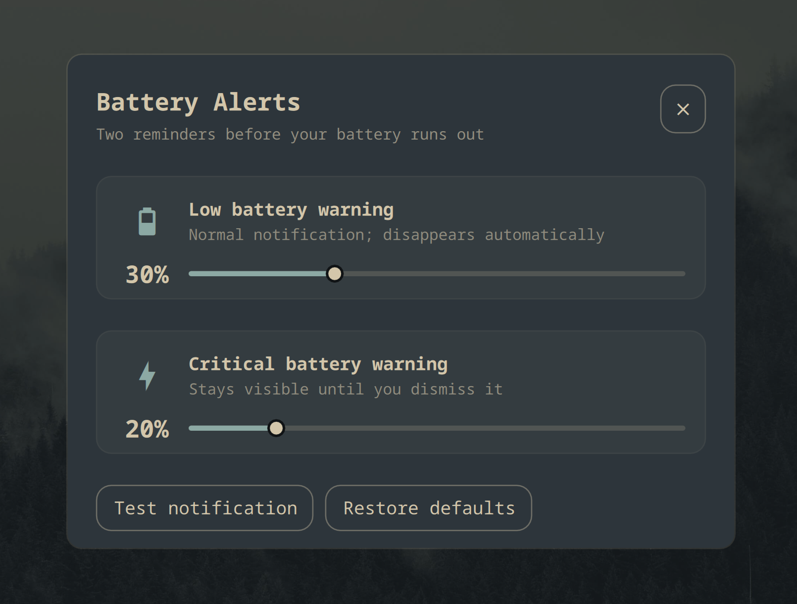

# Battery Alerts for Omarchy

Configurable two-stage battery notifications for the Omarchy shell.

- A normal warning at 30% by default; it disappears automatically.
- The normal notification uses a bundled yellow battery icon.
- A critical warning at 20% by default; it stays visible until dismissed.
- The critical notification uses a bundled red warning icon so it remains
  noticeable across icon themes.
- Each warning appears once per discharge session and resets after AC power is
  connected.
- Runs alongside Omarchy's built-in battery service without replacing it.
- A small settings panel opens directly or from an optional Omarchy menu entry.
- No extra icon is added to the top bar.



## Requirements

- Omarchy 4 with `omarchy-shell`, its notification service, and UPower.
- Python 3 only when using the optional menu helper scripts.

The plugin and its helpers do not require `sudo`, fetch remote content, or run
downloaded code.

## Install

```bash
omarchy plugin add https://github.com/NeroSong/omarchy-battery-alerts --enable
```

Open the settings panel directly with:

```bash
omarchy-shell shell summon nerosong.battery-alerts
```

The panel lets you change both thresholds, restore the defaults, and send both
test notifications. Changes take effect immediately and are saved in:

```text
~/.config/omarchy/battery-alerts.json
```

The once-per-discharge notification state is stored separately in:

```text
~/.local/state/omarchy/battery-alerts.json
```

Both sliders use the same fixed 5–90% range. The critical threshold cannot be
higher than or equal to the normal warning threshold; dragging one across the
other moves the other threshold with it while preserving at least a 1% gap.
At the range edges the pair stops at 5/6% or 89/90%. The service also validates
a hand-edited settings file before use.

This is an independent third-party service. It does not replace, clone, or
modify Omarchy's built-in `omarchy.battery` service, so future Omarchy updates
to battery handling and power-profile switching continue to apply normally.
Omarchy's stock 10% warning remains enabled and may appear after this plugin's
configurable warnings. This plugin only reads battery state from UPower; it
neither triggers nor listens for Omarchy's `battery-low` hook.

## Optional Omarchy menu entry

Omarchy currently stores user menu extensions in one shared file rather than a
drop-in directory. The plugin manager does not run install hooks, so adding a
menu entry is a separate, optional step.

The included helper adds a marked Battery Alerts block while preserving other
entries. Before changing the shared menu file, it saves the previous version as
`omarchy-menu.jsonc.battery-alerts.bak`, then replaces the file atomically.

```bash
~/.config/omarchy/plugins/nerosong.battery-alerts/bin/install-menu-entry
```

If you prefer not to run the helper, add the entry manually instead.

To make **Battery Alerts** searchable from the Omarchy menu, add the following
entry inside the outer object in
`~/.config/omarchy/extensions/omarchy-menu.jsonc`. Add a comma before or after
the entry when another entry is adjacent to it.

```jsonc
"setup.battery-alerts": {
  "icon": "󱐋",
  "label": "Battery Alerts",
  "aliases": ["battery", "low battery"],
  "description": "Configure low and critical battery thresholds",
  "action": "omarchy-shell shell summon nerosong.battery-alerts"
}
```

## Uninstall

If you installed the menu entry with the helper, remove it before removing the
plugin:

```bash
~/.config/omarchy/plugins/nerosong.battery-alerts/bin/uninstall-menu-entry
```

If you added it manually, delete only the `"setup.battery-alerts"` entry from
`~/.config/omarchy/extensions/omarchy-menu.jsonc`. Then remove the plugin:

```bash
omarchy plugin remove nerosong.battery-alerts
```

Settings and per-discharge state are intentionally kept so reinstalling
preserves them. Delete both as well with:

```bash
rm -f -- ~/.config/omarchy/battery-alerts.json \
  ~/.local/state/omarchy/battery-alerts.json
```

Here `--` ends option parsing, so every following argument is treated as a file
path.

The menu helper keeps its safety backup after uninstall. Once you have verified
that the remaining menu entries are intact, you may remove that backup with:

```bash
rm -f -- ~/.config/omarchy/extensions/omarchy-menu.jsonc.battery-alerts.bak
```

## Development

```bash
node tests/test_battery_model.js
python3 tests/test_menu_scripts.py
omarchy plugin validate .
```

The service uses Quickshell's native UPower integration and checks every 60
seconds, plus an immediate check whenever the power source changes. It uses
Omarchy's notification sender for display, without changing the built-in
battery service or its 10% warning.

## License

Licensed under the [MIT License](LICENSE).
